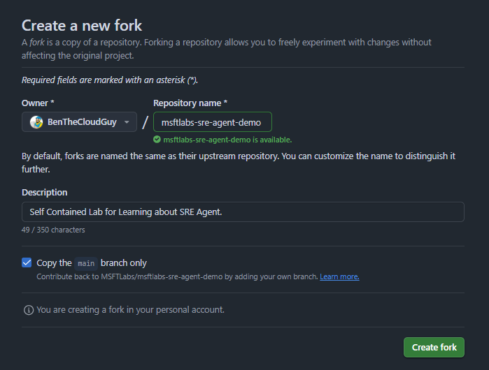

# SRE Agent Demo

Self-contained lab environment for validating and testing Azure SRE Agent capabilities.


## Architecture

| Resource | Purpose |
|---|---|
| **App Service (Linux/.NET 8)** | Multi-page web app with login, dashboard, profile, settings |
| **Azure SQL Database** | User credential storage, session-backed authentication |
| **Application Insights** | Telemetry, performance monitoring, error tracking |
| **Log Analytics Workspace** | Centralized log collection |
| **Function App (Python)** | Chaos engineering API — triggers issues for SRE Agent to detect |
| **Key Vault** | Stores SQL connection string and secrets (RBAC-secured) |

## Prerequisites

- [Azure Developer CLI (azd)](https://learn.microsoft.com/azure/developer/azure-developer-cli/install-azd)
- [Azure CLI](https://docs.microsoft.com/cli/azure/install-azure-cli)
- [.NET 8 SDK](https://dotnet.microsoft.com/download/dotnet/8.0)
- [Python 3.11](https://www.python.org/downloads/)
- [Azure Functions Core Tools v4](https://docs.microsoft.com/azure/azure-functions/functions-run-local)

> **Tip:** Use the included `.devcontainer` with GitHub Codespaces or VS Code Dev Containers — all tools are pre-installed.

## Project Structure

```
├── .devcontainer/          # Dev container configuration
├── infra/                  # Bicep infrastructure (azd)
│   ├── main.bicep          # Main orchestrator
│   ├── main.parameters.json
│   └── modules/
│       ├── monitoring.bicep    # Log Analytics + App Insights
│       ├── keyvault.bicep      # Key Vault + secrets
│       ├── sql.bicep           # SQL Server + Database
│       ├── appservice.bicep    # App Service Plan + Web App
│       └── functionapp.bicep   # Storage + Function App
├── src/
│   ├── web/                # ASP.NET Core 8 MVC application
│   │   ├── Controllers/    # Home, Account, Dashboard
│   │   ├── Data/           # EF Core DbContext + seeder
│   │   ├── Models/         # User, ViewModels
│   │   └── Views/          # Razor views
│   └── api/                # Python Azure Function App
│       └── function_app.py # Chaos engineering endpoints
├── azure.yaml              # Azure Developer CLI config
└── README.md
```

## Step 1: Quick Start

### Fork Repo to your GitHub Account



### Clone forked repo or launch codespace

```powershell
git clone git@github.com:MSFTLabs/msftlabs-sre-agent-demo.git
```

More pending testing...
