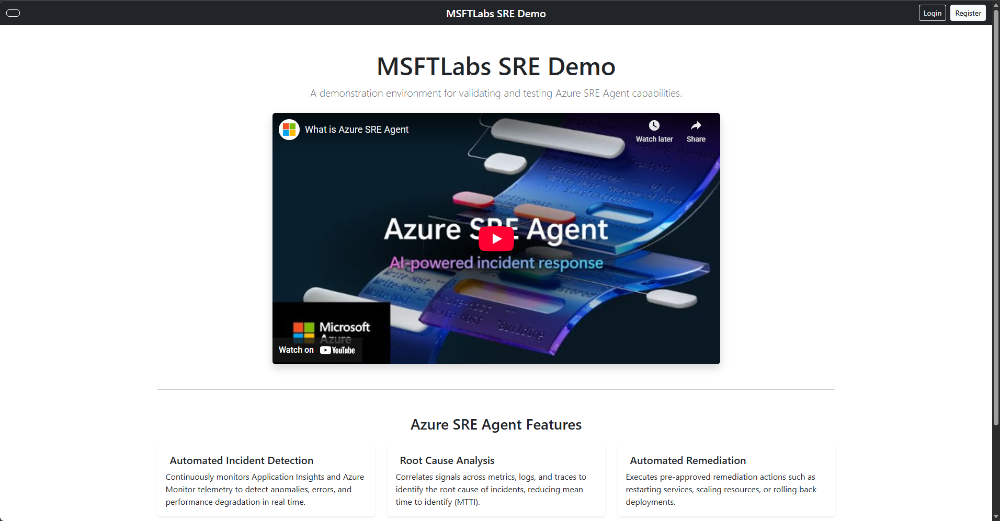

# SRE Agent Demo

Self-contained lab environment for demonstrating Azure SRE Agent capabilities. One-click deployment, portal-triggered incident.



## Architecture

| Resource                               | Purpose                                                                         |
| -------------------------------------- | ------------------------------------------------------------------------------- |
| **App Service (Linux/.NET 8)**         | Multi-page web app with health probe, DB-driven content                         |
| **Application Gateway (WAF_v2)**       | OWASP 3.2 Prevention mode, public entry point, health probe polling             |
| **Azure SQL Database**                 | Content storage (SitePages), Entra-only auth, per-IP firewall (selected networks) |
| **Application Insights**               | Telemetry, performance monitoring, error tracking                               |
| **Log Analytics Workspace**            | Centralized log collection, WAF firewall logs, diagnostics                      |

## Demo Scenario

The demo simulates a real-world security policy change breaking a production application:

1. **User disables "Public network access"** on the Azure SQL Server via the Azure Portal
2. The App Service loses SQL connectivity — pages return errors, health probe reports **SQL FAIL**
3. Application Gateway health probe detects the unhealthy backend and returns **HTTP 502 Bad Gateway**
4. **Azure Monitor alert fires** ("AppGW Unhealthy Backend", Sev 1)
5. **SRE Agent** picks up the incident and autonomously investigates — checking Activity Log for recent changes, SQL Server configuration, Application Gateway backend health, and Application Insights telemetry
6. SRE Agent identifies the root cause (public network access disabled), reverts the change, and summarizes the incident

> **Note:** It takes several minutes after disabling public network access for the change to propagate and the health probe to fail.

## Prerequisites

- [Azure Developer CLI (azd)](https://learn.microsoft.com/azure/developer/azure-developer-cli/install-azd)
- [Azure CLI](https://docs.microsoft.com/cli/azure/install-azure-cli)
- [.NET 8 SDK](https://dotnet.microsoft.com/download/dotnet/8.0)

## Getting Started

Ensure you are logged in to both CLIs (they use **separate** credential stores):

```powershell
# Azure CLI login
az login
az account set --subscription "<your-subscription-id>"

# Azure Developer CLI login (must match the same tenant)
azd auth login --tenant-id "<your-tenant-id>"
```

> **Tip:** Get your tenant ID with `az account show --query tenantId -o tsv`

---

### Quick Deploy

```powershell
git clone https://github.com/MSFTLabs/msftlabs-sre-agent-demo.git
cd msftlabs-sre-agent-demo

az login
azd auth login --tenant-id "$(az account show --query tenantId -o tsv)"

azd init
azd env set AZURE_SUBSCRIPTION_ID "$(az account show --query id -o tsv)"
azd env set AZURE_LOCATION "eastus2"
azd env set AZURE_PRINCIPAL_ID "$(az ad signed-in-user show --query id -o tsv)"
azd env set AZURE_AAD_ADMIN_LOGIN "$(az ad signed-in-user show --query userPrincipalName -o tsv)"
azd up
```

The `postprovision` hook grants the web app managed identity `db_owner` on the SQL database and seeds content. The `postup` hook prints the **Application Gateway public URL**.

> **Note:** MCAPS policy requires SQL Entra-only auth at server creation. The identity env vars are passed to Bicep for the SQL admin configuration.

### AZD Command Reference

| Command | Purpose |
|---|---|
| `azd up` | Provision + deploy + postup hook (full deployment) |
| `azd provision` | Deploy Bicep infrastructure + run postprovision hook |
| `azd deploy` | Build & deploy src/web (.NET) only |
| `azd down` | Delete all Azure resources |
| `azd env get-values` | Show all env variables for current environment |
| `azd monitor --overview` | Open Application Insights overview |

---

## Project Structure

```
├── infra/                  # Bicep infrastructure (azd)
│   ├── main.bicep          # Main orchestrator
│   ├── main.parameters.json
│   └── modules/
│       ├── appgateway.bicep    # Application Gateway + WAF v2
│       ├── appservice.bicep    # App Service Plan + Web App
│       ├── monitoring.bicep    # Log Analytics + App Insights
│       ├── sql.bicep           # SQL Server + Database
│       ├── sql-firewall.bicep  # Per-IP firewall rules (App Service outbound IPs)
│       ├── alerts.bicep        # Azure Monitor alert (AppGW unhealthy backend)
│       └── diagnostics.bicep   # Diagnostic settings
├── src/
│   └── web/                # ASP.NET Core 8 MVC application
│       ├── Controllers/    # Home, Health
│       ├── Data/           # EF Core DbContext
│       ├── Models/         # SitePage, ViewModels
│       └── Views/          # Razor views
├── scripts/
│   ├── postprovision.ps1   # SQL access + DB seeding
│   ├── postup.ps1          # Display App Gateway URL
│   ├── chaos-triggers.ps1  # Optional chaos triggers (WAF, SQL firewall)
│   └── seed-db/            # .NET console tool for DB content seeding
├── knowledgeFiles/         # SRE Agent knowledge file
├── demo/GUIDE.md           # Full demo walkthrough
├── azure.yaml              # Azure Developer CLI config
└── README.md
```
